1. Зарегистрироваться в качестве разработчика на [Dev-портале «Группы Астра»](https://lk.astra.ru/).

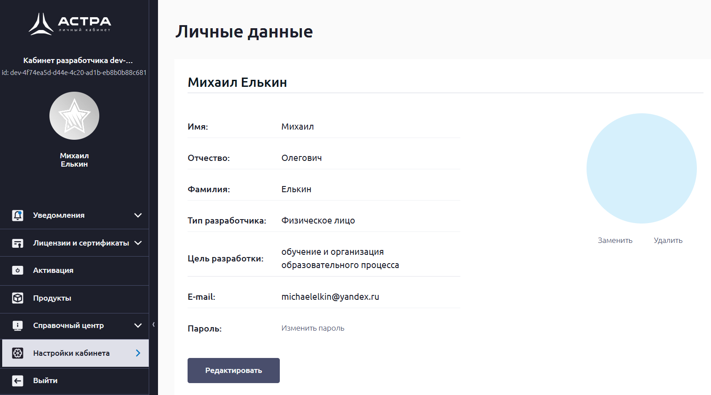

2. Загрузить образ Astra Linux Special Edition 1.8.3 из личного кабинета разработчика.

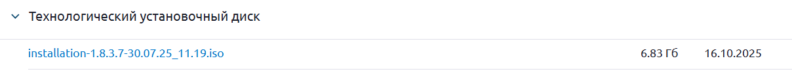

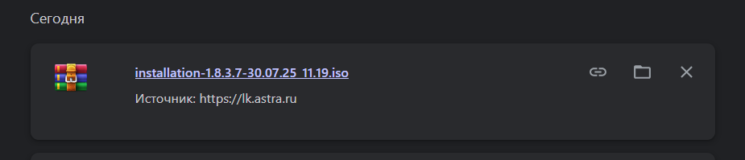

3. Установить менеджер виртуальных машин.

Был использован уже скачанный ранее менеджер ВМ - VirtualBox

4. Проанализировать системные требования к Astra Linux Special Edition 1.8 и выполнить установку системы в виртуальной машине.

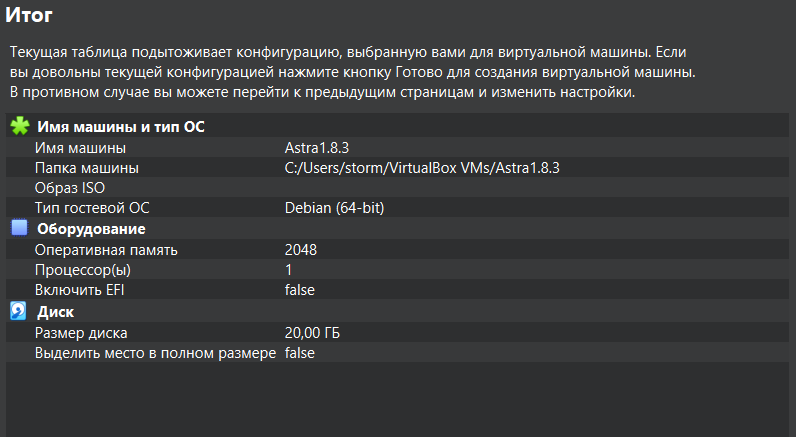

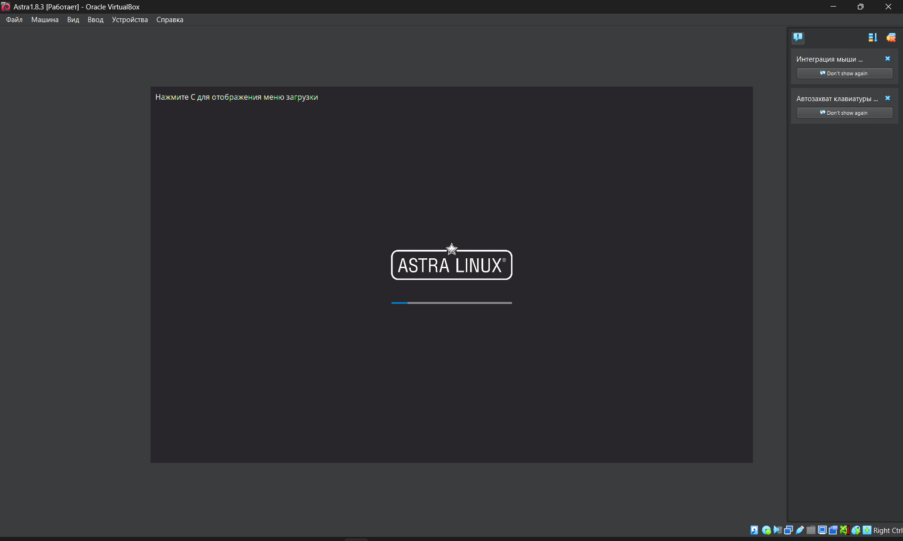

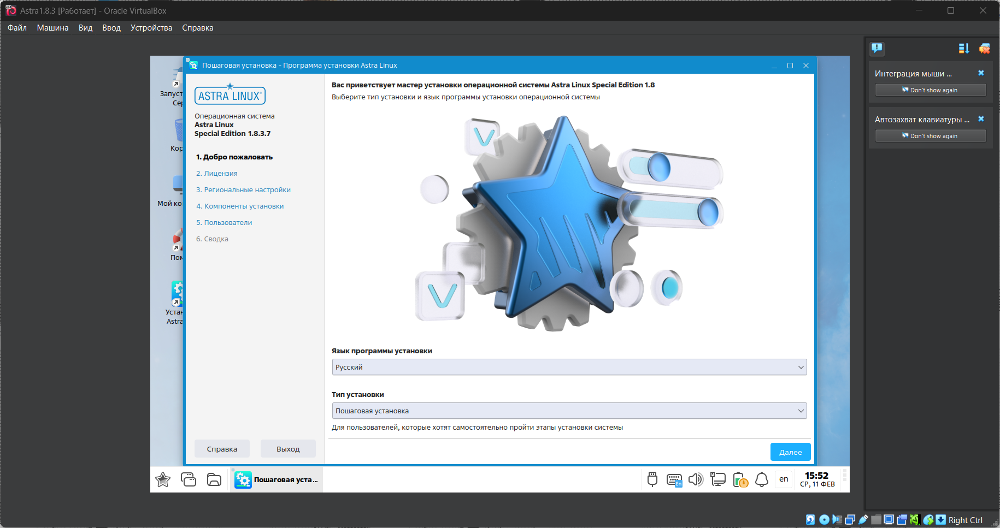

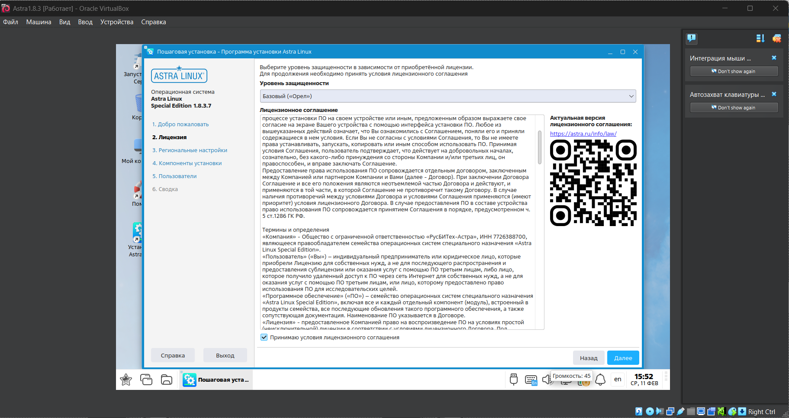

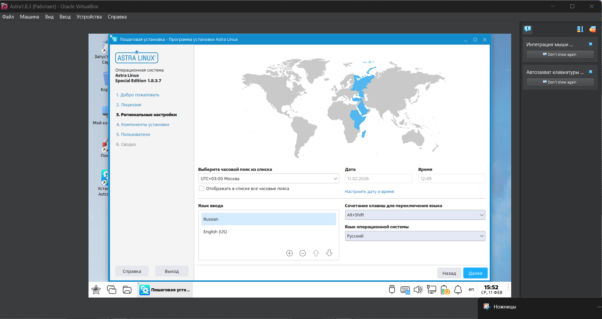

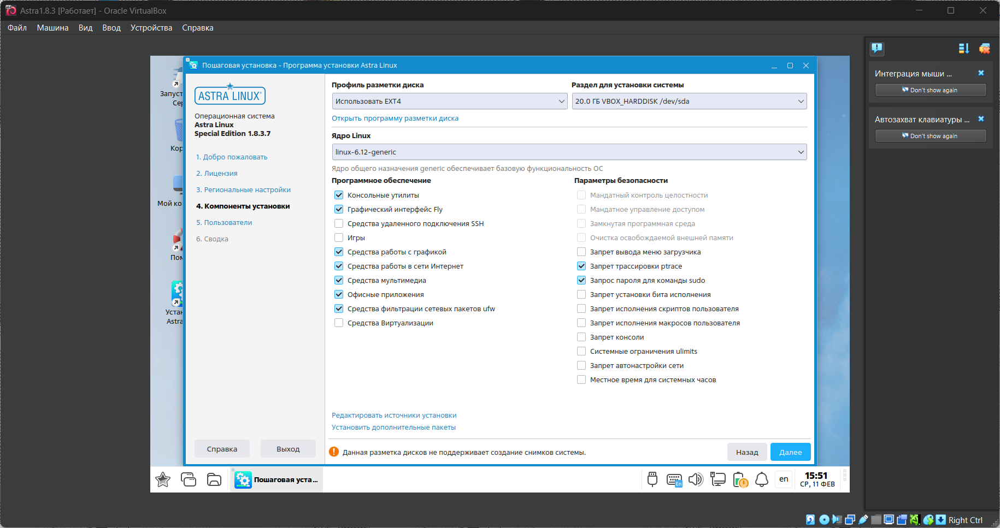

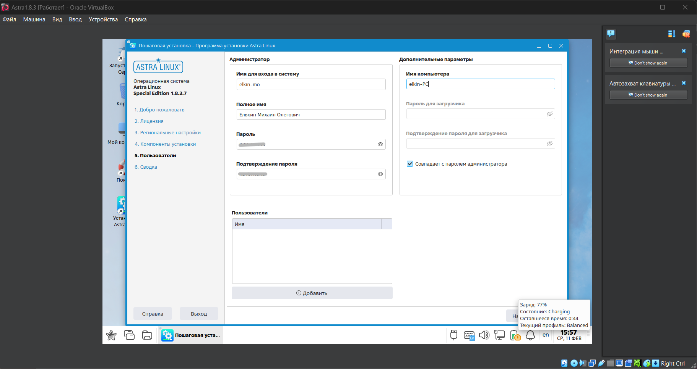

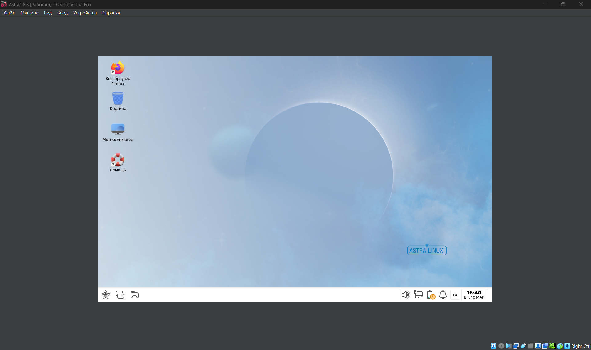

5. Составить отчёт о проделанной работе со скриншотами.

