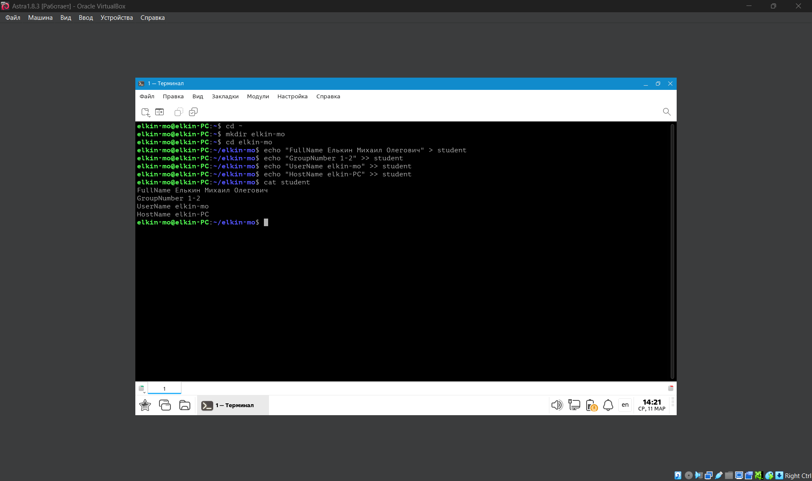
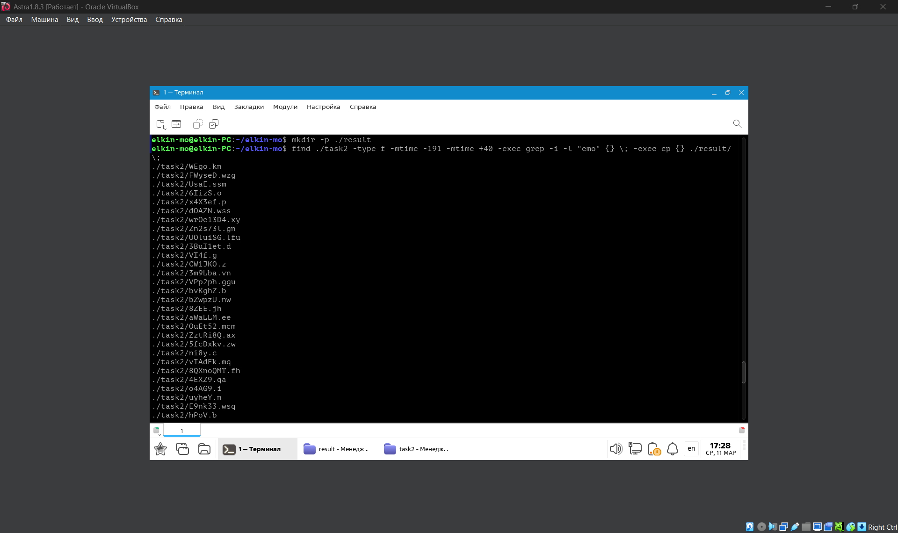
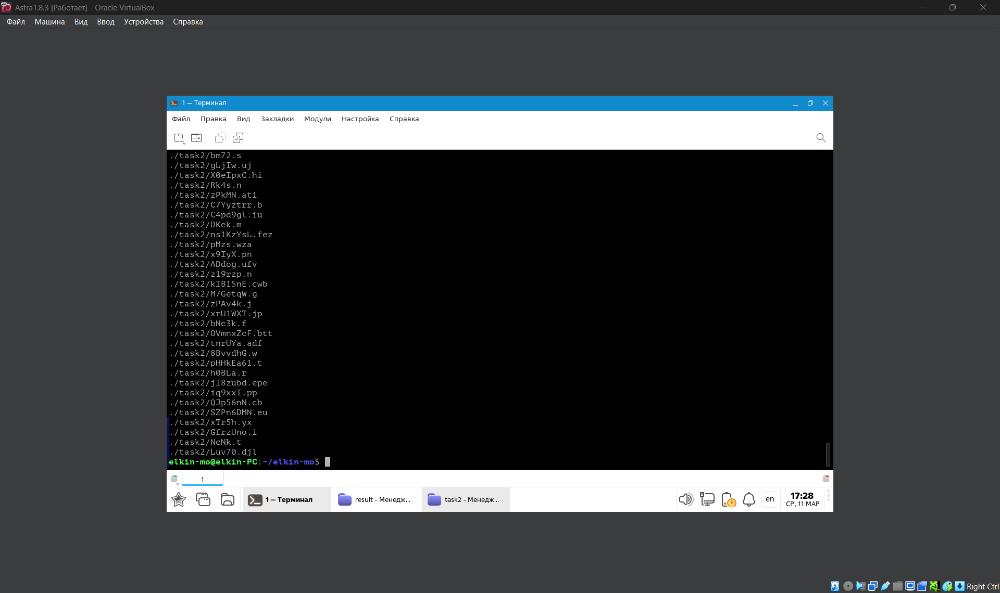
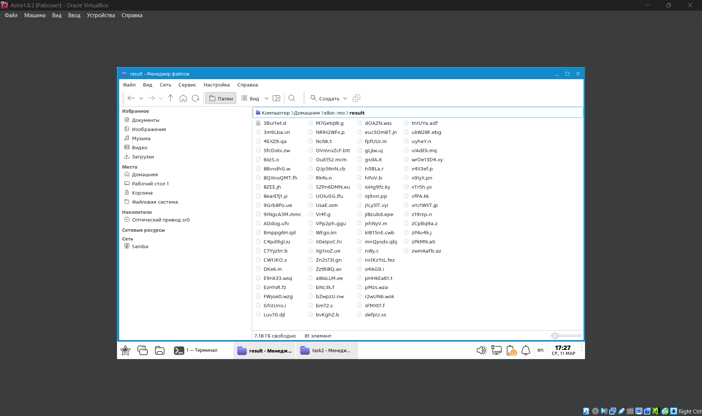
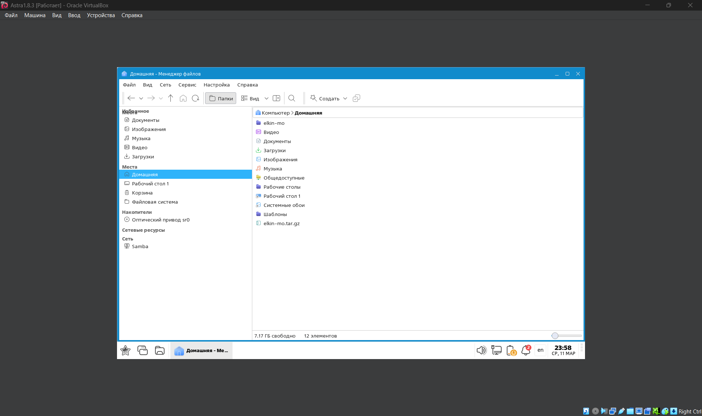
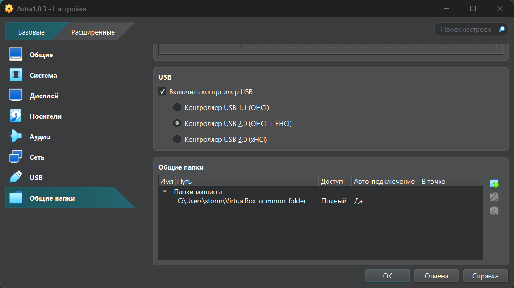
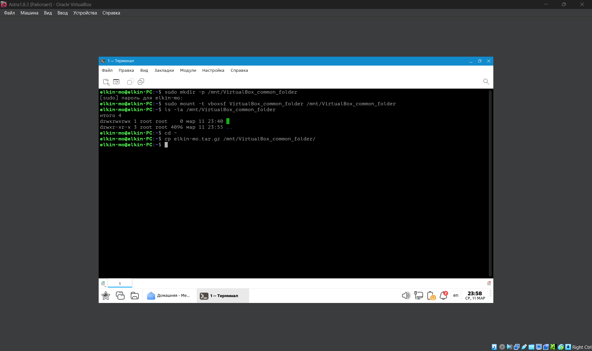

## Часть 1

Создаем каталог с именем в формате <Ваша фамилия>-<Ваши инициалы>.
	`~$ mkdir elkin-mo`

Внутри каталога создаем файл **student** с полями:
- **FullName** - ФИО
- **GroupNumber** - номер группы (1-1 / 1-2 / 2)
- **UserName** - имя пользователя в системе
- **HostName** - имя компьютера

Добавление значений для каждого поля выполним через команду `echo`
	`~/elkin-mo$ echo "FullName Елькин Михаил Олегович" > student`
	`~/elkin-mo$ echo "GroupName 1-2" >> student`
	`~/elkin-mo$ echo "UserName elkin-mo" >> student`
	`~/elkin-mo$ echo "HostName elkin-PC" >> student`
где ">" - перезаписывает файл, ">>" - добавляет в конец файла.

В результате создан каталог со структурой `elkin-mo` => `student.txt`.
## Часть 2

Был загружен [архив из условия задания](https://disk.yandex.ru/d/chKWm5FmbUmTOg), скачен на виртуальную машину и распакован в папку `elkin-mo`.

При помощи команды `find` в терминале внутри архива находим все файлы модифицированные в период с 1го сентября 2025 до 31го января 2026, через флаги `-mtime` 
	`find ./task2 - type f -mtime -191 -mtime +40`

Чтобы искать файлы по содержимому воспользуемся командой `grep`, но для этого заменим команду `find` с помощью команды `-exec` 
	 `-exec grep -i -l -name " * emo * " {}\; `

Далее все так же через `-exec` заменим `grep` на добавление найденных файлов в папку `result`.
	`-exec cp {} ./result/ \;` 

Терминал выведет все файлы подходящие условию.

В папке `result` отобразятся все добавленные файлы из архива.

Сохраним папку `elkin-mo` как архив типа `.tar.gz`. 

Но для переноса с виртуальной машины на компьютер потребуется создать общую папку между ними. В проводнике создаем новую папку которая будет служить как общая папка и настройках ВМ указываем ее путь. 

Для настройки общей папки на ВМ, в терминале через каталог `/mnt/` создадим точку монтирования в папке `VirualBox_common_folder`
	`sudo mkdir -p /mnt/VirualBox_common_folder`

Подключим общую папку через `vboxsf` 
	`sudo mount -t vboxsf VirualBox_common_folder /mnt/VirualBox_common_folder`

Перейдем в домашний каталог и скопируем архив в общую папку.
	`cp elkin-mo.tar.gz /mnt/VirualBox_common_folder/`

После этого перенос архива с результатами выполнения задания с ВМ на основной компьютер будет окончено.