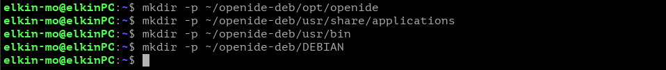
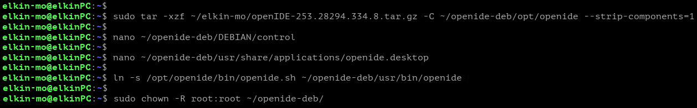
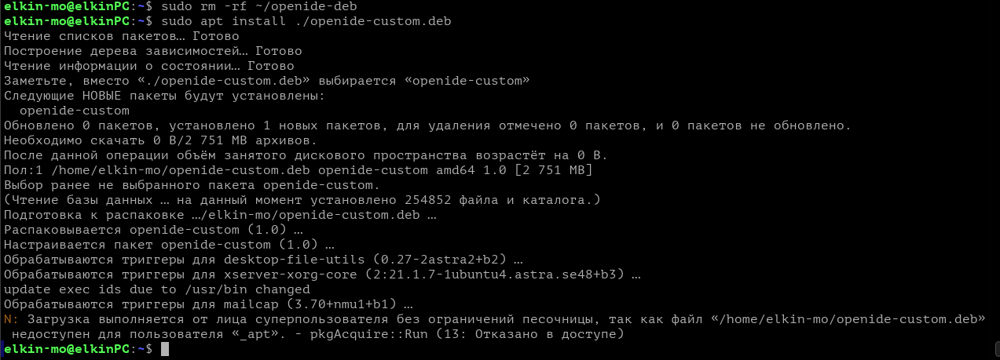
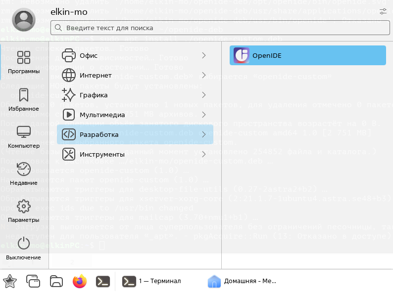
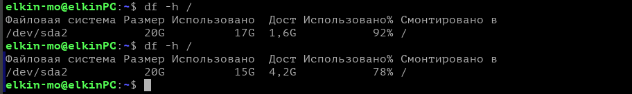
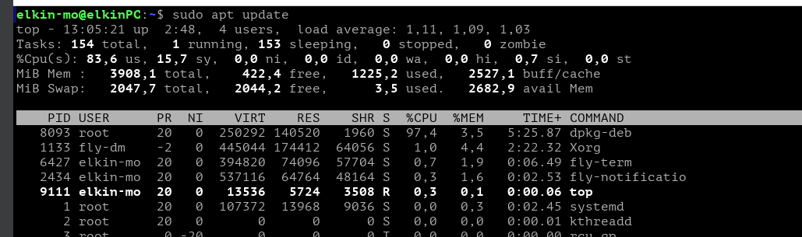

В домашней директории создаем имитацию корневой структуры папок, а именно каталог метаданных(`/DEBIAN`), структуру для бинарных файлов и ярлыков(`/opt, /usr`), 

Архив скачанный в предыдущей лабораторной был извлекаем и распаковываем в созданный только что каталог
В каталоге метаданных создаем файл с основной информацией о пакете
Создаем файл инициализации рабочего стола openide.desktop для интеграции приложения в меню "пуск"
Создаем символическую ссылку для запуска программы, на подобие классических ярлыков
Меняем владельца и группы файлов на `root` 

Столкнувшись с нехваткой оперативной памяти виртуальной машины при попытке сборки пакета с сжатием двух(2.6) гигабайтов файлов, принимаем решение проводить сборку без сжатия, что логично приводит к катастрофической нехватке места на диске. Проблему решаем удалением кэша всех видов и файлов приложений blender, chromium, thunderbird, vs code. Сборка пакета проходит успешно

Чтобы освободить место для установки пакета, удаляем созданный ранее каталог со всеми файлами, потому что он уже упакован в пакет типа `.deb`, 

Установка проходит успешно, приложение `OpenIDE` появляется в разделе разработка в меню пуск
В дополнение к отчету о работе не прилагается deb-пакет, потому что после часов копания в пакетах openIDE хотелось скорее от них избавиться, поэтому все что было установлено и развернуто, было благополучно снесено под ноль, требование о необходимости приложить к отчету пакет было прочитано мной уже после, извините

На скриншоте представлена ситуация с которой пришлось столкнуться при сборке пакета, вывод после первого запроса показывает доступное место на машине при первой попытке собрать пакет без сжатия, и соответственно доступное место после очистки с помощью функций(`apt autoremove, apt clean, apt purge code blender ..`)

Здесь представлена загруженность процессора при сборке пакета со сжатием 2.6 Гб памяти, за кадром остались еще десять минут смиренного ожидания окончания сборки, которые ни к чему не привели
