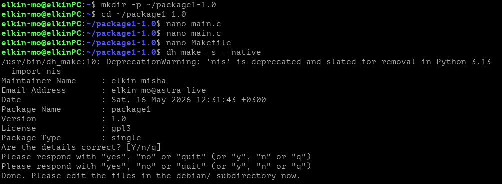
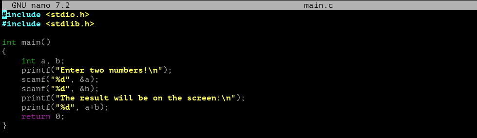
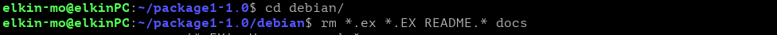
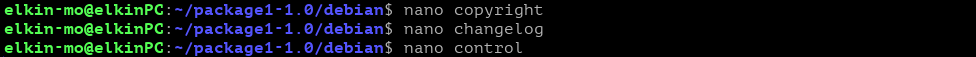
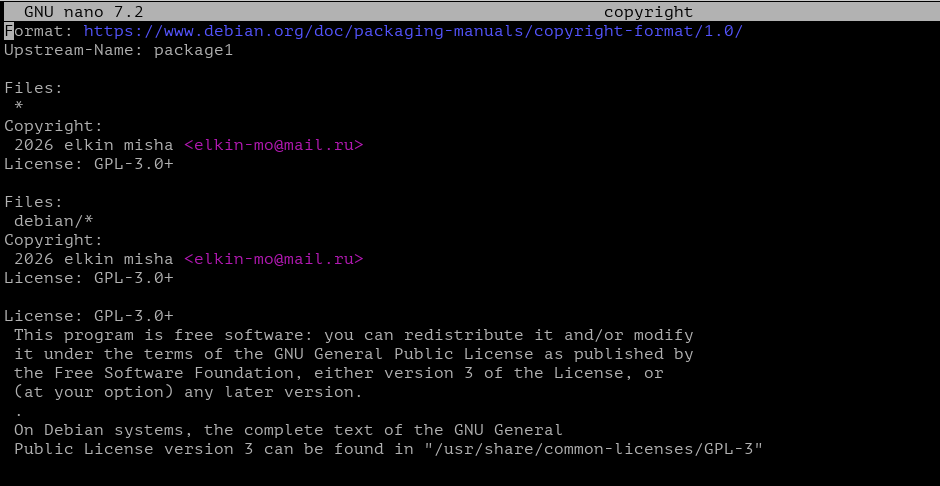
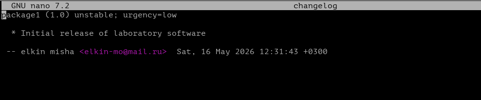
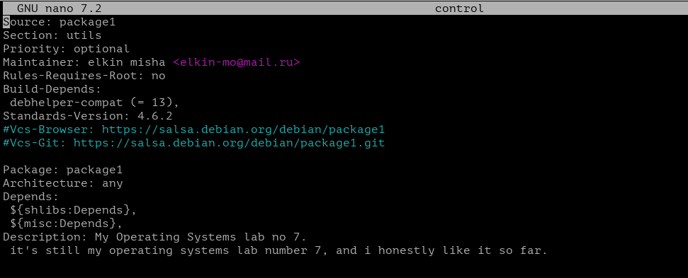
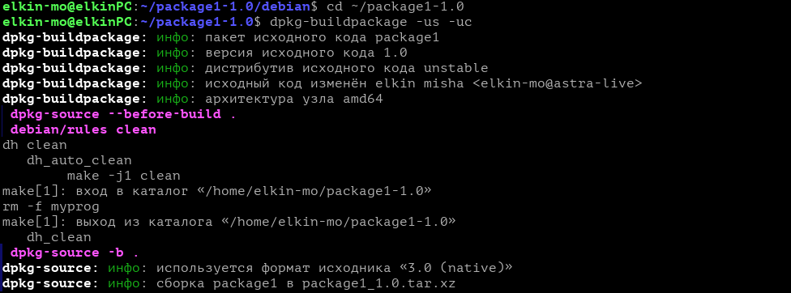
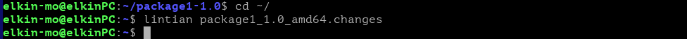

Скачиваем компиляторы для gcc, инструмент для генерации шаблонов конфигурационных файлов, набор скриптов для автоматизации сборки пакетов, для сопровождения пакетов и сам `lintian` анализатор структуры готовых пакетов

Создаем рабочий каталог, в нем исходный код программы `main.c` с кодом от первой лабы по программированию первого курса
Затем так же создаем файл автоматизации компиляции `Makefile` 
Через `dh_make -s --native` преобразуем каталог с кодом в заготовку пакета, добавив в него подкаталог `debian/` с управляющими файлами

Исходный код программы `main.c`

В каталоге конфигурации убираем все лишнее для базовой сборки

Отредактируем ключевые файлы сборки

Вот содержимое всех файлов, важный момент из-за которого `lintian` может выдать ошибку, это везде где нужно указывать пользователя ставить вместо `<..@astra-live>` адрес якобы почты или любой электронный адрес, потому что `lintian` проверяет адрес по регулярным выражениям стандартов интернета, не обязательно рабочий, как в нашем случае `<elkin-mo@mail.ru>`

Запускаем утилиту автоматической сборки, ждем результат

Сразу после запускаем проверку пакета.